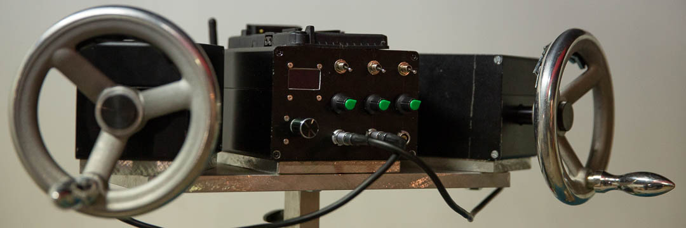
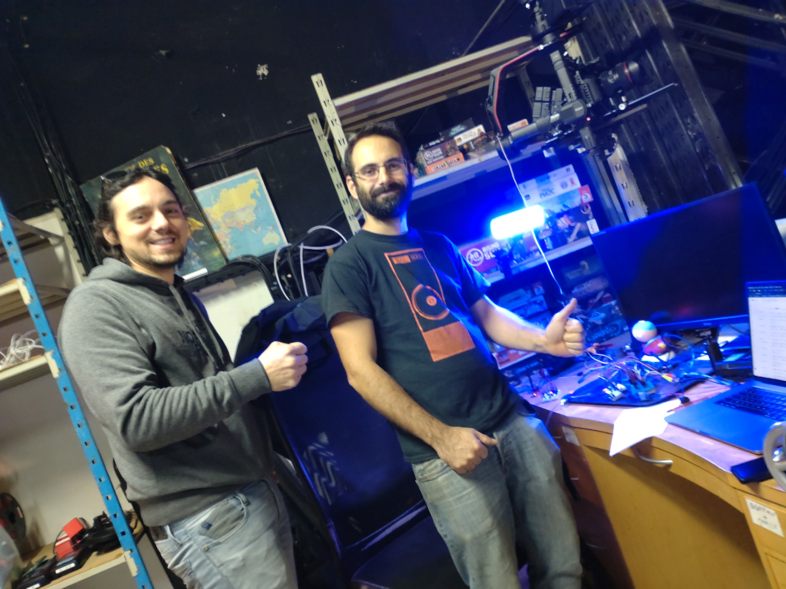

# Kinowheels 3-Axis wireless for DJI Ronin
Project made with __Quentin Boschini__.

# Description
Use the [Kino wheels](https://www.kinowheels.com/) to command a DJI Ronin (tested on DJI Ronin 2, DJI Ronin S)via SBUS protocol using Arduino boards.\
Transmition to the Ronin can be done via a cable or wirelessly with a main transmitter powered by a Vlock batterie and a receiver powered by the Ronin.

# Hardware
- You can find all the Fritzing schematics in the repo.

## Transmitter - Receiver
- 1x Arduino DUE (transmitter)
- 1x Arduino NANO (receiver)
- 2x Nrf24L01 (wireless 2,4 GHz module)
- 2x LCD 0.96' Adafruit I2C (using Adafruit SSD1306 library)
- 2x Rotary encoder SPI (for interaction with the lcd fonction, for now only modify nrf24 channel)
- 3x Potentiometer (used to amplify or reduce the kinowheel values send to the SBUS)
- 3x Toggle Switch (to invert the wheel rotation)
- 2x SN74HC logical inverter (required for transmitting SBUS signal)

## Optional debug Sbus receiver
A Sbus receiver, usefull to have a direct return from a Sbus signal for debugging purpose\
- 1x Arduino UNO
- 1x LCD 0.96' Adafruit I2C
- 1x SN74HC logical inverter

# Arduino Libraries
- BMC_SBUS -> https://github.com/boldstelvis/BMC_SBUS
- BMC_SBUS_DUE (just a modified version from the one bellow you can find it in the repository)
- Adafruit_SSD1306 -> download from the Arduino IDE
- Adafruit_GFX -> download from the Arduino IDE (automaticaly installed with Adafruit_SSD1306 ?)
- RF24 -> https://github.com/nRF24/RF24
- sbus-arduino (for the debug SBUS receiver) -> https://github.com/bolderflight/sbus

# Future plan
- [ ] Controlling modes and profiles with external buttons or with sub menus with the LCD
- [ ] Designing new wheels more balanced, with conic shaped axis

## Still work in progress, will upload tutos and photos...

